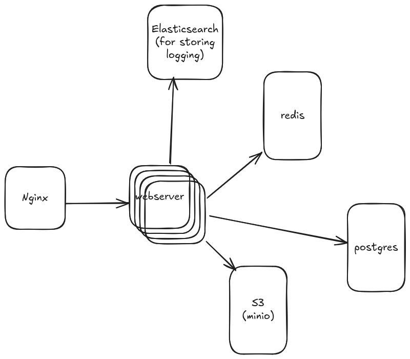

## 1. System Design.

### Functional Requirements
- The service should list different cities where its affiliated cinemas are located.
- When user selects a city, the service should display movies released in that particular city.
- When user selects movie, the service should display the cinemas running the movie plus available show times.
- Users should be able to book a show at a cinema and book tickets.
- The service should be able to show the user the seating arrangement of the cinema hall. The user should be able to select multiple seats according to the preference.
- The user should be able to distinguish between available seats from booked ones.
- Users should be able to put a hold on the seat (for 5 minutes) while they make payments.
- Users should be able to wait if there is a chance that the seats might become available (When holds by other users expire).
- Waiting customers should be serviced in a fair, first come, first serve manner.

### Non-Functional Requirements
- The service should be highly concurrent. There will be multiple booking requests for the same seat at any particular point in time.
- The system has financial transactions, meaning it should be secure and the DB should be ACID compliant.
- Assume traffic will spike on popular/much-awaited movie releases and the seats would fill up pretty fast, so the service should be highly scalable and highly available to keep up with the surge in traffic.

## 3. System APIs
### Searching movies
### Reserving Seats
#### Request.
```
POST api/v1/reserve
{
    'show_seats': [id1, id2, id3]
}
```

#### Backend process
```python
from typing import List

from redis import Redis
from rq import Queue
from sqlmodel import select, update, insert


q = Queue(connection=Redis())


def revoke_expired_reserved_seats():
    """
    Background task to track expired show seats, if time for holding show seats have been expired,
    convert these seats to `AVAILABEL` status, so that other users can reserve these ones.

    Using https://python-rq.org/ to execute task at schedule
    """
    pass


@app.post('/api/v1/reserve')
async def reserve_seat(show_seat_ids: List[int], user_id: int, amount: float):
    """
    """
    await db.session.execute(
        sm.select(ShowSeat)
        .where(ShowSeat.id.in_(show_seat_ids), ShowSeat.status == 'AVAILABLE')
        .with_for_update()
    ) 

    booking = await db.session.scalar(
        sm.insert(Booking)
        .values(
            number_of_seats=len(show_seat_ids),
            timestamp=datetime.now(),
            status='IN-BOOKING',
            reservation_expires_at=datetime.now() + timedelta(minutes=5),
            user_id=user_id,
            show_id=show_id
        )
    )

    payment = await db.session.scalar(
        sm.insert(Payment)
        .values(
            amount=amount,
            timestamp=datetime.now(),
            booking_id=booking.id
        )
    )
    
    await db.session.execute(
        sm.update(ShowSeat)
        .where(ShowSeat.id.in_(show_seat_ids))
        .values(status='IN-RESERVED', booking_id=booking.id)
    )

    await db.session.commit()

    url = "https://test-payment.momo.vn/v2/gateway/api/create"
    payload = {
        "partnerCode": "ABCDEF",
        "amount": amount,
        "orderId": str(booking.id),
        "orderInfo": "Seat reservation for movie",
        "redirectUrl": "https://tickket-master.com/api/v1/payment/success",
        "ipnUrl": "https://tickket-master.com/api/v1/payment/notify",
    }
    response = requests.post(url, payload)

    job = queue.enqueue_at(datetime.now() + timedelta(minutes=5), revoke_expired_reserved_seats)

    if response.status_code != 200: raise HTTPException(status_code=500, detail="Failed to generate payment QR code")


@app.post('/api/v1/payment/notify', status_code=status.HTTP_200_OK)
async def payment_notify(data: dict):
    """
    After client pay for their reservation successfully, the payment gateway will call this API for notification.

    1. If the moment of recieving payment notification is less than `booking.reservation_expires_at` => Let's update
    the reserved show seats to "PAID".

    2. If the moment of recieving payment notification is expired to `booking.reservation_expires_at`.
        2.1. reserved show seats have not been booked by other yet.
            => Let's update the reserved show seats to "PAID".
        
        2.2. reserved show seats have been booked by other.
            => Notify Customer Support team via some channels such as slack, discord ... CS team can deal with clients,
            let provide tools help CS to refund money to user manually when they need.

            => directly refund money to user without intervening from CS team. 
    """
    transaction_status = data.get("status")
    booking_id = data.get("orderId")
    payment_amount = data.get("amount")
    payment_transaction_id = data.get("transId")

    booking = db.session.scalar(sm.select(Booking).where(Booking.id == uuid.UUID(booking_id)))
    show_seats = db.session.scalars(sm.select(ShowSeat).where(ShowSeat.booking_id == uuid.UUID(booking_id)))

    if datetime.now() > booking.reservation_expires_at:
        if booking.number_of_seats > len(show_seats):
            logger.warning(
                'Refund to user because one of reserved seat has been reserved by others',
                extra={'booking_id': booking_id, 'show_seats': [seat.id for seat in show_seats]}
            )
            initiate_refund(payment_transaction_id, payment_amount)
            
            await db.session.execute(sm.update(Booking).where(Booking.id = uuid.UUID(booking_id)).values(status='FAILED'))
            await db.session.execute(sm.update(Payment).where(Payment.booking_id = uuid.UUID(booking_id)).values(payment_method='MOMO', transaction_id=payment_transaction_id))
            for seat in show_seats:
                seat.booking_id = None
                seat.status = 'AVAILABLE'
                db.session.add(seat)
            await db.session.commit()
            return JSONResponse(content={'message': 'ok'})
        
        else:
            logger.error(
                'Refund to user because the number of reserved seats is abnormally greater than number of seats in the respective booking',
                extra={'booking_id': booking_id, 'show_seats': [seat.id for seat in show_seats]}
            )
            initiate_refund(payment_transaction_id, payment_amount)
            
            await db.session.execute(sm.update(Booking).where(Booking.id = uuid.UUID(booking_id)).values(status='FAILED'))
            await db.session.execute(sm.update(Payment).where(Payment.booking_id = uuid.UUID(booking_id)).values(payment_method='MOMO', transaction_id=payment_transaction_id))
            for seat in show_seats:
                seat.booking_id = None
                seat.status = 'AVAILABLE'
                db.session.add(seat)
            await db.session.commit()
            raise Exception()

        if all([seat.status == 'IN-BOOKING' for seat in show_seats]):
            await db.session.execute(sm.update(Booking).where(Booking.id = uuid.UUID(booking_id)).values(status='PAID'))
            await db.session.execute(sm.update(Payment).where(Payment.booking_id = uuid.UUID(booking_id)).values(payment_method='MOMO', timestamp=datetime.now(), transaction_id=payment_transaction_id))
            for seat in show_seats:
                seat.status = 'RESERVED'
                db.session.add(seat)
            await db.session.commit()
            logger.info(
                'Booking successfully even if user pay for the reservation in expiration',
                extra={'booking_id': booking_id, 'show_seats': [seat.id for seat in show_seats]}
            )
            return JSONResponse(content={'message': 'ok'})
        else:
            logger.warning(
                'Refund to user'
            )
            initiate_refund(payment_transaction_id, payment_amount)
            return JSONResponse(content={'message': 'ok'})
    else:
        await db.session.execute(sm.update(Booking).where(Booking.id = uuid.UUID(booking_id)).values(status='PAID'))
        await db.session.execute(sm.update(Payment).where(Payment.booking_id = uuid.UUID(booking_id)).values(payment_method='MOMO', timestamp=datetime.now(), transaction_id=payment_transaction_id))
        for seat in show_seats:
            seat.status = 'RESERVED'
            db.session.add(seat)
            await db.session.commit()
        await db.session.commit()
        return JSONResponse(content={'message': 'ok'})

def initiate_refund(transaction_id: str, amount: float):
    url = "https://test-payment.momo.vn/v2/gateway/api/refund"
    payload = {
        "partnerCode": "<your_partner_code>",
        "requestId": f"refund_{transaction_id}",
        "orderId": f"refund_{transaction_id}",
        "amount": amount,
        "description": "Refund for late payment",
        "transId": transaction_id
    }
    response = requests.post(url, json=payload)
    if response.status_code != 200:
        logger.error(
            'Refund to user failed',
            extra={'transaction_id': transaction_id, 'amount': amount}
        ) 
        raise HttpException("Refund failed")
    
    return response.json()
```


## 4. DB Design
&nbsp;


## 5. High Level Design


## Concurrent handling.
- Using redis to create a distributed lock in order to resolve the concurrent issues. When a user reserve a ticket, a lock will be acquired on that ticket by creating a lock on redis server. The subsequent users also want to reserve the ticket see the required lock will be responded immediately with 403 status code. There is other simpler way is to use database lock but using redis to create distributed lock might be better in performance aspect.

## Deployment Instruction.

### 1. Create database, cache.
```bash
docker compose -f dockers/docker-compose.yml up -d
```
